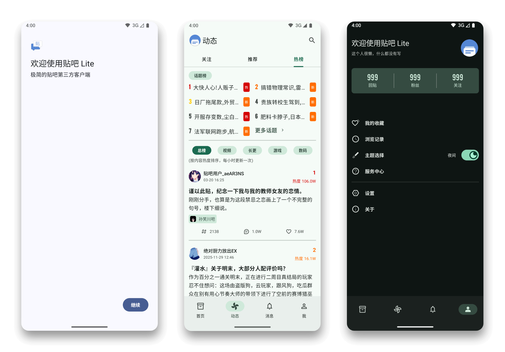

# <p align="center">Tieba Lite</p>
<div align="center">
    <a href="https://github.com/0ranko0P/TiebaLite/blob/main/LICENSE">
        
    </a>
    <a href="https://github.com/0ranko0P/TiebaLite/actions/workflows/build.yml">
        
    </a>
    <a href="https://t.me/tblite_discuss">
        
    </a>
    <br/>
    <br/>
    <p>极简的贴吧<strong>第三方</strong>客户端</p>
    
</div>

## 说明

**本软件及源码仅供学习交流使用，严禁用于商业用途。**

## 下载
* [Github Releases](https://github.com/0ranko0P/TiebaLite/releases)
* 下载每夜版: [Github Actions](https://github.com/0ranko0P/TiebaLite/actions/workflows/build.yml)

## 构建

1. 克隆仓库
```shell
git clone https://github.com/0ranko0P/TiebaLite.git
cd TiebaLite
```

2. 配置应用签名 (非必须)

编辑 `signing.properties.example` 填写密钥库路径，密钥别名与密码。保存为 `signing.properties`

3. 开始构建
```shell
./gradle assembleRelease
```

成功后，构建的产物在 `app/build/outputs/apk` 下。


## 友情链接

+ [Starry-OvO/aiotieba: Asynchronous I/O Client for Baidu Tieba](https://github.com/Starry-OvO/aiotieba)
+ [n0099/tbclient.protobuf: 百度贴吧客户端 Protocol Buffers 定义文件合集](https://github.com/n0099/tbclient.protobuf)
